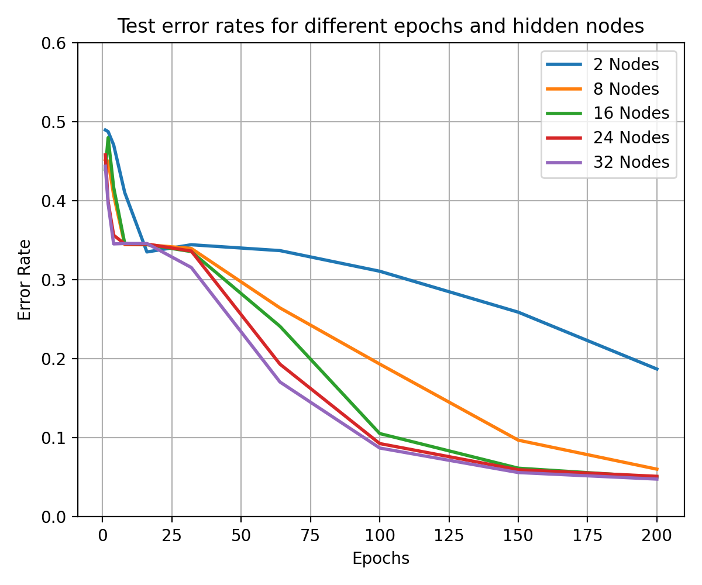

# Shallow Neural Network Training Coursework

Evaluating a neural network using the MatLab `cancer_dataset`. Development contained in the [nncw.ipynb](nncw.ipynb) notebook.

1. Evaluate the network's tendency to overfit by varying the number of epochs and hidden layers being used
2. Multiple classifier performance using majority vote
3. Repeat 2 with two different optimisers (`trainlm`, `trainrp`)
4. ***Extension***: Distinguish between two equi-probable classes of overlapping 2D Gaussians

## Timing

### exp 1

CPU: 2min 36s ± 1.66 s per loop (mean ± std. dev. of 2 runs, 2 loops each)

GPU: 3min 5s ± 2.95 s per loop (mean ± std. dev. of 2 runs, 2 loops each)

### exp 2

CPU: 26 s ± 62.9 ms per loop (mean ± std. dev. of 2 runs, 2 loops each)

GPU: 57.6 s ± 46.7 ms per loop (mean ± std. dev. of 2 runs, 2 loops each)

### exp 3

CPU: 1min 19s ± 1.6 s per loop (mean ± std. dev. of 2 runs, 2 loops each)

GPU: 3min 25s ± 280 ms per loop (mean ± std. dev. of 2 runs, 2 loops each)